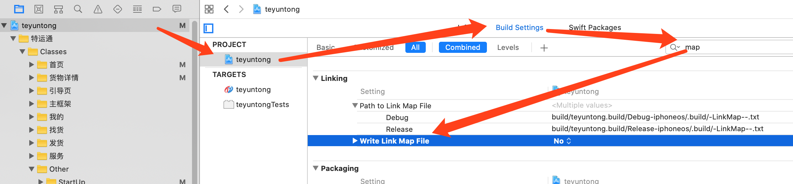
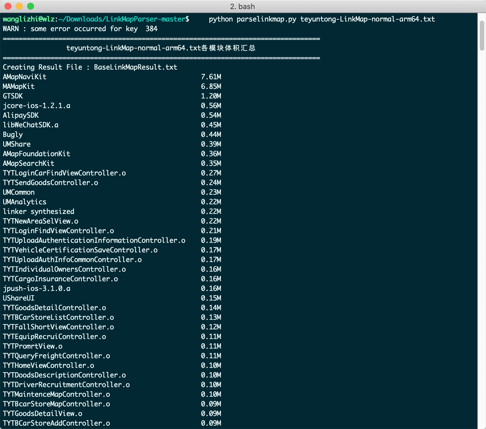
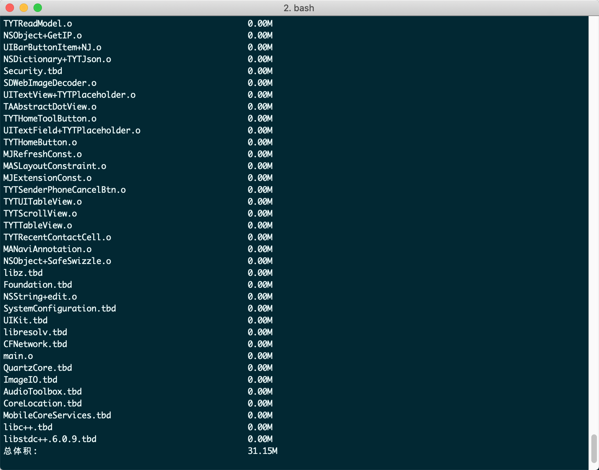

经过上次瘦身我们的可执行文件已经从54.4M缩小为24.6M，那么这24.6M里边到底包含些什么东西呢，接下来我们就来研究一下，其实最重要的是最后一步，看看可执行文件中哪些文件占的体积大，可以针对性优化

## 一、```Link Map```文件生成
按照图中步骤，在```Xcode```中设置```Write Link Map File```为```YES```,允许```LinkMap```文件写入本地



编译项目，然后参考```Path to Link Map File```寻找到文件路径如下，如果不知道```DerivedData```下边哪个是你的项目，你就把目录下的文件全删了，重新编译就会出现你现在的项目了

```
/Users/wanglizhi/Library/Developer/Xcode/DerivedData/teyuntong-dubdxtwoxsmbyvgqehamoxsavmuc/Build/Intermediates.noindex/teyuntong.build/Debug-iphoneos/teyuntong.build/teyuntong-LinkMap-normal-arm64.txt
```
这个文件就是可执行文件的全部了，共361156行

## 二、```Link Map```文件解析
```Link Map```文件主要有以下几块信息

- ```Path```：此文件对应安装包的地址
- ```Arch```：app架构
- ```Object file```：目标文件列表
- ```Sections```：各种数据类型所占内存空间
- ```Symbols```：类名、变量名、方法名等符号
- ```Dead Stripped Symbols```：没用的符号

```Path```、```Arch```这两个我相信就不用多说了，下面我们分析一下其它类型
### 2.1、```Object files```
```
# Object files:
[  0] linker synthesized
[  1] /Users/wanglizhi/Library/Developer/Xcode/DerivedData/teyuntong-dubdxtwoxsmbyvgqehamoxsavmuc/Build/Intermediates.noindex/teyuntong.build/Debug-iphoneos/teyuntong.build/Objects-normal/arm64/UIScrollView+MJExtension.o
[  2] /Users/wanglizhi/Library/Developer/Xcode/DerivedData/teyuntong-dubdxtwoxsmbyvgqehamoxsavmuc/Build/Intermediates.noindex/teyuntong.build/Debug-iphoneos/teyuntong.build/Objects-normal/arm64/TYTSetPasswordController.o
[  3] /Users/wanglizhi/Library/Developer/Xcode/DerivedData/teyuntong-dubdxtwoxsmbyvgqehamoxsavmuc/Build/Intermediates.noindex/teyuntong.build/Debug-iphoneos/teyuntong.build/Objects-normal/arm64/TYTMyGoodsModel.o
[  4] /Users/wanglizhi/Library/Developer/Xcode/DerivedData/teyuntong-dubdxtwoxsmbyvgqehamoxsavmuc/Build/Intermediates.noindex/teyuntong.build/Debug-iphoneos/teyuntong.build/Objects-normal/arm64/BaseMapViewController.o
[  5] /Users/wanglizhi/Library/Developer/Xcode/DerivedData/teyuntong-dubdxtwoxsmbyvgqehamoxsavmuc/Build/Intermediates.noindex/teyuntong.build/Debug-iphoneos/teyuntong.build/Objects-normal/arm64/AppDelegate.o
[  6] /Users/wanglizhi/Library/Developer/Xcode/DerivedData/teyuntong-dubdxtwoxsmbyvgqehamoxsavmuc/Build/Intermediates.noindex/teyuntong.build/Debug-iphoneos/teyuntong.build/Objects-normal/arm64/TYTAbnormalReportController.o
[  7] /Users/wanglizhi/Library/Developer/Xcode/DerivedData/teyuntong-dubdxtwoxsmbyvgqehamoxsavmuc/Build/Intermediates.noindex/teyuntong.build/Debug-iphoneos/teyuntong.build/Objects-normal/arm64/TYTOptimizeRequest.o
[  8] /Users/wanglizhi/Library/Developer/Xcode/DerivedData/teyuntong-dubdxtwoxsmbyvgqehamoxsavmuc/Build/Intermediates.noindex/teyuntong.build/Debug-iphoneos/teyuntong.build/Objects-normal/arm64/TYTGoodsDetailController.o
[  9] /Users/wanglizhi/Library/Developer/Xcode/DerivedData/teyuntong-dubdxtwoxsmbyvgqehamoxsavmuc/Build/Intermediates.noindex/teyuntong.build/Debug-iphoneos/teyuntong.build/Objects-normal/arm64/TYTMapSearchCell.o
[ 10] /Users/wanglizhi/Library/Developer/Xcode/DerivedData/teyuntong-dubdxtwoxsmbyvgqehamoxsavmuc/Build/Intermediates.noindex/teyuntong.build/Debug-iphoneos/teyuntong.build/Objects-normal/arm64/TYTAddDriverController.o
[ 11] /Users/wanglizhi/Library/Developer/Xcode/DerivedData/teyuntong-dubdxtwoxsmbyvgqehamoxsavmuc/Build/Intermediates.noindex/teyuntong.build/Debug-iphoneos/teyuntong.build/Objects-normal/arm64/MJRefreshAutoGifFooter.o
```

### 2.2、```Sections```
描述各个段在可执行文件中的具体信息

下面说下每一列的意思

- ```Address```：偏移量
- ```Size```： 占用内存大小
- ```Segment```：代码段或初始变量
- ```Section```：具体类型

```Segment```跟```Section```的具体解释

- ```__TEXT```：代码段
	- ```__text```： 主程序代码
	- ```__cstring```： c语言字符串
	- ```stubs```：用于动态链接库的stub
	- ```stub_helper```：用于动态链接库的stub
	- ```__const```： const修饰的常量
	- ```__objc_methname```： objc的方法名称
	- ```__objc_methtype```： objc方法类型
	- ```__objc_classname```： objc类方法
- ```__DATA```：已经初始化的变量等
	- ```__objc_ivars```： objc类的实例变量
	- ```__objc_classlist```： objc类列表
	- ```__objc_protolist```： objc协议列表
	- ```__objc_imageinfo```： objc镜像信息
	- ```__objc_const```： objc常量
	- ```__objc_selfrefs```： objc自引用(self)
	- ```__objc_protorefs```： objc协议引用
	- ```__objc_superrefs```： objc超类引用
	- ```__cfstring```： 使用Core Foundation字符串
	- ```__bss``` BSS

```
# Sections:
# Address	Size    	Segment	Section
0x100005A3C	0x014FE08C	__TEXT	__text
0x101503AC8	0x00002E74	__TEXT	__stubs
0x10150693C	0x00002E2C	__TEXT	__stub_helper
0x101509768	0x0008D90F	__TEXT	__objc_methname
0x101597077	0x0000B401	__TEXT	__objc_classname
0x1015A2478	0x00019398	__TEXT	__objc_methtype
0x1015BB810	0x000F92F8	__TEXT	__cstring
0x1016B4B10	0x00080738	__TEXT	__const
0x101735248	0x000B15E8	__TEXT	__gcc_except_tab
0x1017E6830	0x000126B6	__TEXT	__ustring
0x1017F8EE8	0x00036FEC	__TEXT	__unwind_info
0x10182FED8	0x00000124	__TEXT	__eh_frame
0x101830000	0x00000A90	__DATA	__got
0x101830A90	0x00001EF8	__DATA	__la_symbol_ptr
0x101832988	0x000005E0	__DATA	__mod_init_func
0x101832F70	0x00055088	__DATA	__const
0x101887FF8	0x0005ADE0	__DATA	__cfstring
0x1018E2DD8	0x00003940	__DATA	__objc_classlist
0x1018E6718	0x00000048	__DATA	__objc_nlclslist
0x1018E6760	0x000003F0	__DATA	__objc_catlist
0x1018E6B50	0x00000028	__DATA	__objc_nlcatlist
0x1018E6B78	0x000008A0	__DATA	__objc_protolist
0x1018E7418	0x00000008	__DATA	__objc_imageinfo
0x1018E7420	0x00200E58	__DATA	__objc_const
0x101AE8278	0x00022E88	__DATA	__objc_selrefs
0x101B0B100	0x00000080	__DATA	__objc_protorefs
0x101B0B180	0x00003808	__DATA	__objc_classrefs
0x101B0E988	0x000025D8	__DATA	__objc_superrefs
0x101B10F60	0x0000AC64	__DATA	__objc_ivar
0x101B1BBC8	0x00023CD0	__DATA	__objc_data
0x101B3F8A0	0x000354A8	__DATA	__data
0x101B75000	0x00002C00	__DATA	__common
0x101B77C00	0x0000F250	__DATA	__bss
```
咱们看第一行的信息主程序代码的位置是```0x100005A3C```，所占内存的大小是```0x014FE08C```即```c*16^0+8*16^1+0*16^2+E*16^3+F*16^4+4*16^5+1*16^6```，那么第二行的偏移量```0x101503AC8```就等于```0x100005A3C```+```0x014FE08C```
### 2.3、```Symbols```
```Symbols```的信息就是标明方法、属性等占用的内存大小，以及属于哪个类

- ```Address```：偏移量
- ```Size```： 占用内存大小
- ```File```：对应2.2中```Sections```的序号，表明这是哪个类里的方法
- ```Name```：方法名

```
# Symbols:
# Address	Size    	File  Name
0x100005A3C	0x0000008C	[  1] -[UIScrollView(MJExtension) setMj_insetT:]
0x100005AC8	0x00000048	[  1] -[UIScrollView(MJExtension) mj_insetT]
0x100005B10	0x0000008C	[  1] -[UIScrollView(MJExtension) setMj_insetB:]
0x100005B9C	0x00000048	[  1] -[UIScrollView(MJExtension) mj_insetB]
0x100005BE4	0x0000008C	[  1] -[UIScrollView(MJExtension) setMj_insetL:]
0x100005C70	0x00000048	[  1] -[UIScrollView(MJExtension) mj_insetL]
0x100005CB8	0x0000008C	[  1] -[UIScrollView(MJExtension) setMj_insetR:]
0x100005D44	0x00000048	[  1] -[UIScrollView(MJExtension) mj_insetR]
0x100005D8C	0x0000006C	[  1] -[UIScrollView(MJExtension) setMj_offsetX:]
0x100005DF8	0x00000040	[  1] -[UIScrollView(MJExtension) mj_offsetX]
0x100005E38	0x0000006C	[  1] -[UIScrollView(MJExtension) setMj_offsetY:]
0x100005EA4	0x00000040	[  1] -[UIScrollView(MJExtension) mj_offsetY]
0x100005EE4	0x0000006C	[  1] -[UIScrollView(MJExtension) setMj_contentW:]
0x100005F50	0x00000040	[  1] -[UIScrollView(MJExtension) mj_contentW]
0x100005F90	0x0000006C	[  1] -[UIScrollView(MJExtension) setMj_contentH:]
0x100005FFC	0x00000040	[  1] -[UIScrollView(MJExtension) mj_contentH]
0x10000603C	0x000006E0	[  2] -[TYTSetPasswordController viewDidLoad]
```
## 三、计算各个目标文件的体积
计算方法见[LinkMapParser](https://github.com/zgzczzw/LinkMapParser)

```
wanglizhi@wlz:~/Downloads/LinkMapParser-master$     python parselinkmap.py teyuntong-LinkMap-normal-arm64.txt
```
我们```APP```最终的计算结果如下，还是高德的两个SDK占用的位置最可怕，占了可执行文件的二分之一

