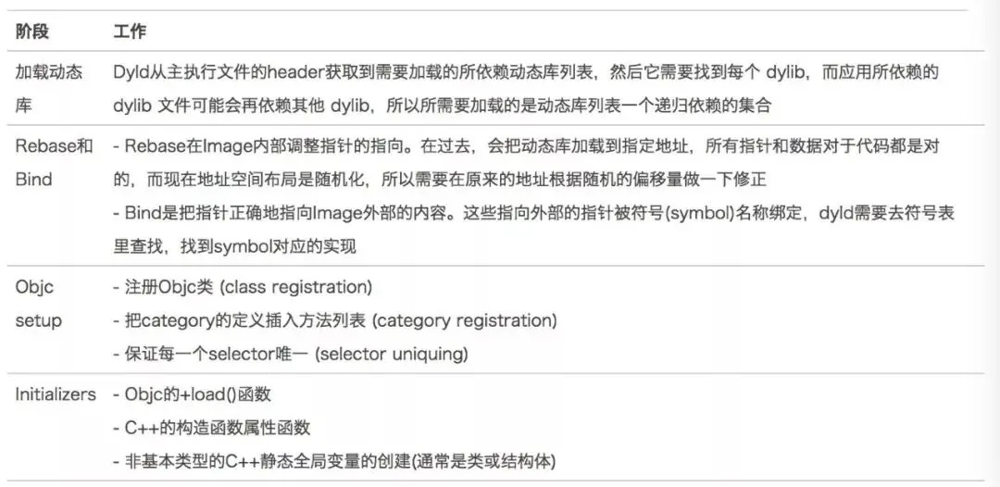
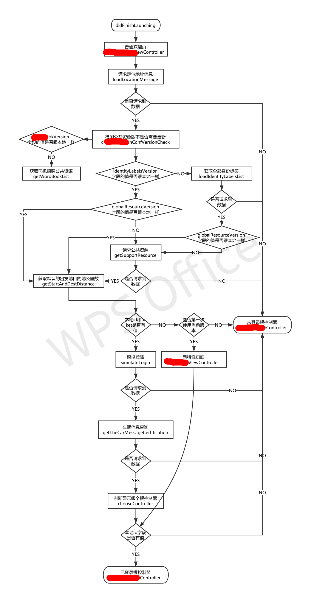

## 一、优化背景
> 我们的```APP```在启动的时候进行了很多串行网络请求，在没有网络请求不到数据的情况下，```APP```甚至都无法进入首页，而且现在首次打开```APP```都要请求网络权限，很多用户再没有看清楚提示信息的情况下就直接点击了不允许，所以就会导致```APP```卡在启动页面，此问题属于历史遗留问题，年纪比我的司龄还长，可能是为了满足产品以及领导各式各样的需求吧。既然这样，那我就把```APP```的启动时间彻底的优化一下。

## 二、启动流程
### 2.1、启动时间
> 个人感觉热启动没什么好说的，所以我们这里只说冷启动。但是冷启动时间的拆分，不同的开发者可能有不同的看法，我这里说一下我的拆分

> T(启动时间) = T1(```main()```之前) + T2(```main()```到首页加载完成)

### 2.2、从```Xcode```的环境变量配置说起
```main()```之后的启动时间好测量，但是```main()```之前的时间我们很难插手，所以苹果为了方便我们测量```APP```的启动时间，给我们提供了比较方便的配置，我们只需要在```Edit Scheme->Run->Arguments->Environment Variables```位置添加环境变量```Name```=```DYLD_PRINT_STATISTICS``` ```Value```=```1```，然后运行```APP```控制台就可以打印如下信息：
```
Total pre-main time: 430.50 milliseconds (100.0%)
         dylib loading time:  38.17 milliseconds (8.8%)
        rebase/binding time:  23.63 milliseconds (5.4%)
            ObjC setup time:  70.71 milliseconds (16.4%)
           initializer time: 297.96 milliseconds (69.2%)
           slowest intializers :
             libSystem.B.dylib :   5.45 milliseconds (1.2%)
    libMainThreadChecker.dylib :  40.02 milliseconds (9.2%)
          libglInterpose.dylib : 210.29 milliseconds (48.8%)
                     teyuntong :  24.92 milliseconds (5.7%)
```
如果你需要更详细的信息，那么就可以添加这个环境变量```Name```=```DYLD_PRINT_STATISTICS_DETAILS``` ```Value```=```1```，运行```APP```打印信息如下：

```
  total time: 1.0 seconds (100.0%)
  total images loaded:  393 (381 from dyld shared cache)
  total segments mapped: 45, into 1734 pages
  total images loading time: 512.74 milliseconds (46.7%)
  total load time in ObjC:  62.35 milliseconds (5.6%)
  total debugger pause time: 468.37 milliseconds (42.7%)
  total dtrace DOF registration time:   0.00 milliseconds (0.0%)
  total rebase fixups:  344,314
  total rebase fixups time:  34.80 milliseconds (3.1%)
  total binding fixups: 552,747
  total binding fixups time: 238.80 milliseconds (21.7%)
  total weak binding fixups time:   2.63 milliseconds (0.2%)
  total redo shared cached bindings time: 243.06 milliseconds (22.1%)
  total bindings lazily fixed up: 0 of 0
  total time in initializers and ObjC +load: 245.06 milliseconds (22.3%)
                         libSystem.B.dylib :   5.49 milliseconds (0.5%)
               libBacktraceRecording.dylib :   6.98 milliseconds (0.6%)
                           libobjc.A.dylib :   1.72 milliseconds (0.1%)

                libMainThreadChecker.dylib :  36.82 milliseconds (3.3%)
                      libglInterpose.dylib : 162.86 milliseconds (14.8%)
                       libMTLCapture.dylib :   2.95 milliseconds (0.2%)
              libViewDebuggerSupport.dylib :   6.99 milliseconds (0.6%)
                                 teyuntong :  24.24 milliseconds (2.2%)
total symbol trie searches:    1322801
total symbol table binary searches:    0
total images defining weak symbols:  45
total images using weak symbols:  110
```
从控制台打印信息可以看出```APP```冷启动包括```dylib loading```、```rebase/binding```、```ObjC setup```、```initializer```四个部分，从别人文章里偷个图


从上图可以看出影响```APP```启动速度的主要因素如下
> - 动态库的多少
> - 类、方法的多少
> - ```+load```方法的多少
> - ```C```构造函数的多少
> - ```C++```静态全局对象的多少

## 三、T1优化策略
> 既然我们已经知道影响```APP```启动速度的主要原因，那么我们现在就可以对症下药，把```APP```的速度提升起来，由于项目中的业务繁杂，涉及到的类也特别多，虽然经过了下边几步优化，但是T1的变化微乎其微

### 3.1、减少类、方法的数量
> 这里的优化方法参考我的文章[iOS-APP瘦身](https://lizhidada.github.io/2019/10/18/iOS-APP%E7%98%A6%E8%BA%AB/)里边的```2.1```章节

### 3.2、```+load```方法优化
> 全局搜索```+load```方法，把方法体放到```+initialize```方法中，如果必须类加载的时候执行那么就具体问题具体分析，灵活优化

### 3.3、减少动态库的数量
> 相信大家从来都是往```Xcode```里边添加动态库，并没有删除过吧，所以这里还是能删除很多没有用的的动态库，个人觉得删除动态库没有什么好方法，只能删一个编译一下，报错了再```import```进去，下边是我删除的动态库时候做的记录，大部分共享缓存里都有，所以对T1的帮助并不是很大

```
AddressBook.framework 动态库共享缓存里有
CFNetwor.framework 动态库共享缓存里有
WebKit.framework 动态库共享缓存里有
UserNotifications.framework 动态库共享缓存里有
OpenGLES.framework 动态库共享缓存里有
QuartzCore.framework 动态库共享缓存里有
SystemConfiguration.framework 动态库共享缓存里有
Security.framework 动态库共享缓存里有
libz.tbd
libstdc++.6.0.9.tbd
libsqlite3.tbd
libsqlite3.dylib
libc++.1.tbd
ImageIO.framework 动态库共享缓存里有
CoreBluetooth.framework 动态库共享缓存里有
CoreFoundation.framework 动态库共享缓存里有
AVFoundation.framework 动态库共享缓存里有
CoreGraphics.framework 动态库共享缓存里有
CoreLocation.framework 动态库共享缓存里有
CoreTelephony.framework 动态库共享缓存里有
CoreText.framework 动态库共享缓存里有
Foundation.framework 动态库共享缓存里有
JavaScriptCore.framework 动态库共享缓存里有
MAMapKit.framework
UMShare.framework
UIKit.framework 动态库共享缓存里有
```
### 3.4、```C++```相关优化
> 对```C++```不了解，所以项目里也没有```C++```代码

## 四、T2优化策略
> 这部分优化跟```APP```的架构有很大的关系，架构好的话这部分可能压根就不需要优化，这里说下我的优化情况吧，下图是我们```APP```在启动的时候所做的操作，相当恐怖



> 针对接口的优化策略就是当前所有接口全部后移，```didFinishLaunching```之后直接加载首页，数据安排到合适的地方进行异步获取，这步可要仔细点，别该出岔子，改完之后让测试同事仔细测一下

> 优化结果如下图所示，T2由```1.91s```优化为```0.19s```


