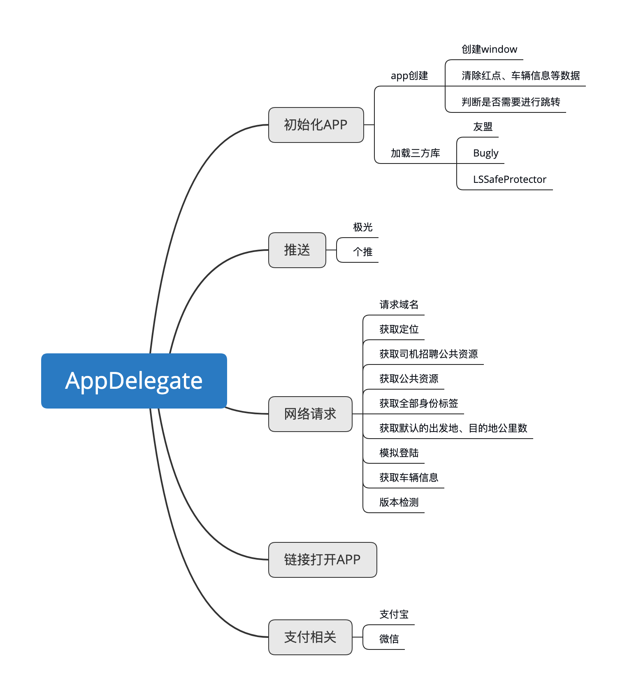
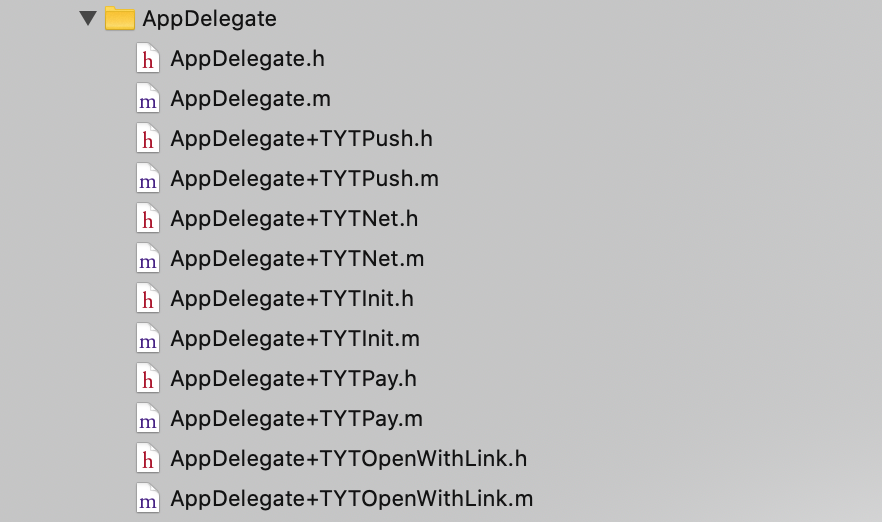

AppDeleagate瘦身真的是一个大家都会面临到的问题，我也是调研了两周，才选定了一个相对简单、容易理解的一个创建分类的方案，我也在我们```APP```里边进行了实践，接下来给大家介绍一下我的瘦身过程。
## 一、分析```AppDeleagate```的结构
要对```AppDeleagate```进行瘦身，首先要对这个文件的结构有一个清晰的认知，明确知道这个类当前有什么功能，并且要考虑扩展性、健壮性，下边是我们项目```AppDeleagate ```的结构

## 二、创建分类
从上图可知，```AppDeleagate```中大概分为5个模块，所以我们创建了五个分类分别对应思维导图中的五个模块，如下：

## 三、设计思路
现在我们以```AppDelegate+TYTPush```为例，对分类的设计思路进行介绍，

```
NS_ASSUME_NONNULL_BEGIN

/**
 *  处理app推送相关代码
 */
@interface AppDelegate (TYTPush)<JPUSHRegisterDelegate, GeTuiSdkDelegate>

///初始化推送配置
- (void)push_application:(UIApplication *)application didFinishLaunchingWithOptions:(NSDictionary *)launchOptions;

///调用过用户注册通知方法之后执行（也就是调用完registerUserNotificationSettings:方法之后执行）
- (void)push_application:(UIApplication *)application didRegisterUserNotificationSettings:(UIUserNotificationSettings *)notificationSettings;

///接收推送令牌deviceToken
- (void)push_application:(UIApplication *)application didRegisterForRemoteNotificationsWithDeviceToken:(NSData *)deviceToken;

///接收推送令牌deviceToken失败
- (void)push_application:(UIApplication *)application didFailToRegisterForRemoteNotificationsWithError:(NSError *)error;

///app后台获取干的事情就是在用户打开应用之前就有机会(只是有机会)执行代码来获取数据，刷新UI
- (void)push_application:(UIApplication *)application performFetchWithCompletionHandler:(void (^)(UIBackgroundFetchResult))completionHandler;

///APP已经接收到远程通知   app处于前台调用此方法
- (void)push_application:(UIApplication *)application didReceiveRemoteNotification:(NSDictionary *)userInfo;

///APP已经接收到远程通知   app处于后台或者被杀死状态，收到远程通知后，当你进入程序时，调用此方法
- (void)push_application:(UIApplication *)application didReceiveRemoteNotification:(NSDictionary *)userInfo fetchCompletionHandler:(void (^)(UIBackgroundFetchResult result))completionHandler;

///当应用程序在前台接收到本地通知时调用
- (void)push_application:(UIApplication *)application didReceiveLocalNotification:(UILocalNotification *)notification;
```
从上边可以看出我们起的方法名字跟系统的名字一样，但是我们给方法名字加上前缀```push_```，这样即美观又防止了方法冲突，这里建议大家创建分类的时候都给分类加上前缀，一旦跟系统类或者其它分类方法名冲突，就会导致同名方法只执行一个，具体的大家可以自己测试，
由于实现文件设计到公司业务代码，所以```.m```文件只贴出来几个方法

```
///初始化推送配置
- (void)push_application:(UIApplication *)application didFinishLaunchingWithOptions:(NSDictionary *)launchOptions{
    //极光
    JPUSHRegisterEntity * entity = [[JPUSHRegisterEntity alloc] init];
    entity.types = JPAuthorizationOptionAlert|JPAuthorizationOptionBadge|JPAuthorizationOptionSound;
    [JPUSHService registerForRemoteNotificationConfig:entity delegate:self];
    [JPUSHService setupWithOption:launchOptions appKey:JpushKey channel:@"appStore" apsForProduction:NO advertisingIdentifier:nil];
    [JPUSHService registrationIDCompletionHandler:^(int resCode, NSString *registrationID) {
        NSLog(@"registrationID =  %@",registrationID);
        [TYTDefault setObject:registrationID forKey:@"registrationID"];
        [TYTDefault synchronize];
    }];
    NSNotificationCenter *defaultCenter = [NSNotificationCenter defaultCenter];
    [defaultCenter addObserver:self selector:@selector(push_networkDidReceiveMessage:) name:kJPFNetworkDidReceiveMessageNotification object:nil];
    //个推
    // 通过个推平台分配的 appId、 appKey 、appSecret 启动 SDK,注: 该方法需要在主线程中调用
    [GeTuiSdk startSdkWithAppId:kGtAppId appKey:kGtAppKey appSecret:kGtAppSecret delegate:self];
    // 注册 APNS
    [self push_registerUserNotification];
    // 处理远程通知启动 APP
    [self push_receiveNotificationByLaunchingOptions:launchOptions application:application];
}

///调用过用户注册通知方法之后执行（也就是调用完registerUserNotificationSettings:方法之后执行）
- (void)push_application:(UIApplication *)application didRegisterUserNotificationSettings:(UIUserNotificationSettings *)notificationSettings {
    // 注册远程通知（推送）
    [application registerForRemoteNotifications];
}

///接收推送令牌deviceToken
- (void)push_application:(UIApplication *)application didRegisterForRemoteNotificationsWithDeviceToken:(NSData *)deviceToken {
    [GeTuiSdk registerDeviceTokenData:deviceToken];
    [JPUSHService registerDeviceToken:deviceToken];
}

///接收推送令牌deviceToken失败
- (void)push_application:(UIApplication *)application didFailToRegisterForRemoteNotificationsWithError:(NSError *)error {
    //如果APNS注册失败，通知个推服务器
    [GeTuiSdk registerDeviceToken:@""];
}
```
接下来就参照此分类依次创建剩下的四个分类
## 四、功能整合
分类创建完成之后，就回到系统类里边，把五个分类的功能进行整合，这次不涉及丝毫的业务代码，可以把全部代码都放出来

```
#import "AppDelegate.h"
#import "AppDelegate+TYTNet.h"
#import "AppDelegate+TYTPush.h"
#import "AppDelegate+TYTInit.h"
#import "AppDelegate+TYTPay.h"
#import "AppDelegate+TYTOpenWithLink.h"

@interface AppDelegate () <CLLocationManagerDelegate>

@end

@implementation AppDelegate

#pragma mark - UIApplicationDelegate
///app入口
- (BOOL)application:(UIApplication *)application didFinishLaunchingWithOptions:(NSDictionary *)launchOptions {
    //初始化window 以及三方库
    [self init_application:application didFinishLaunchingWithOptions:launchOptions];
    ///初始化链接打开app配置
    [self link_application:application didFinishLaunchingWithOptions:launchOptions];
    //网络请求资源
    [self net_application:application didFinishLaunchingWithOptions:launchOptions];
    //极光个推初始化
    [self push_application:application didFinishLaunchingWithOptions:launchOptions];
    //支付配置初始化
    [self pay_application:application didFinishLaunchingWithOptions:launchOptions];
    return YES;
}

///调用过用户注册通知方法之后执行（也就是调用完registerUserNotificationSettings:方法之后执行）
- (void)application:(UIApplication *)application didRegisterUserNotificationSettings:(UIUserNotificationSettings *)notificationSettings {
    [self push_application:application didRegisterUserNotificationSettings:notificationSettings];
}

///app即将进入前台
- (void)applicationWillEnterForeground:(UIApplication *)application{
    [self init_applicationWillEnterForeground:application];
}

///app已经进入后台
- (void)applicationDidEnterBackground:(UIApplication *)application{
    [self init_applicationDidEnterBackground:application];
}

///当应用程序接收到内存警告的时候就会调用
- (void)applicationDidReceiveMemoryWarning:(UIApplication *)application{
    [self init_applicationDidReceiveMemoryWarning:application];
}

///app被杀死调用
- (void)applicationWillTerminate:(UIApplication *)application{
    [self init_applicationWillTerminate:application];
}

#pragma mark - UIApplicationDelegate - APP通知
///接收推送令牌deviceToken
- (void)application:(UIApplication *)application didRegisterForRemoteNotificationsWithDeviceToken:(NSData *)deviceToken {
    [self push_application:application didRegisterForRemoteNotificationsWithDeviceToken:deviceToken];
}

///接收推送令牌deviceToken失败
- (void)application:(UIApplication *)application didFailToRegisterForRemoteNotificationsWithError:(NSError *)error {
    [self push_application:application didFailToRegisterForRemoteNotificationsWithError:error];
}

///app后台获取干的事情就是在用户打开应用之前就有机会(只是有机会)执行代码来获取数据，刷新UI
- (void)application:(UIApplication *)application performFetchWithCompletionHandler:(void (^)(UIBackgroundFetchResult))completionHandler {
    [self push_application:application performFetchWithCompletionHandler:completionHandler];
}

///APP已经接收到远程通知   app处于前台调用此方法
- (void)application:(UIApplication *)application didReceiveRemoteNotification:(NSDictionary *)userInfo {
    [self push_application:application didReceiveRemoteNotification:userInfo];
}

///APP已经接收到远程通知   app处于后台或者被杀死状态，收到远程通知后，当你进入程序时，调用此方法
- (void)application:(UIApplication *)application didReceiveRemoteNotification:(NSDictionary *)userInfo fetchCompletionHandler:(void (^)(UIBackgroundFetchResult result))completionHandler {
    [self push_application:application didReceiveRemoteNotification:userInfo fetchCompletionHandler:completionHandler];
}

//当应用程序在前台接收到本地通知时调用
- (void)application:(UIApplication *)application didReceiveLocalNotification:(UILocalNotification *)notification{
    [self push_application:application didReceiveLocalNotification:notification];
}

#pragma mark - UIApplicationDelegate - 其它应用进入app
///iOS9以前  其它app通过url进入到自己app的时候调用
- (BOOL)application:(UIApplication *)application openURL:(NSURL *)url sourceApplication:(NSString *)sourceApplication annotation:(id)annotation{
    [self init_application:application openURL:url sourceApplication:sourceApplication annotation:annotation];
    [self link_application:application openURL:url sourceApplication:sourceApplication annotation:annotation];
    [self pay_application:application openURL:url sourceApplication:sourceApplication annotation:annotation];
    return YES;
}

///iOS9以后  其它app通过url进入到自己app的时候调用
- (BOOL)application:(UIApplication *)app openURL:(NSURL *)url options:(NSDictionary<NSString *,id> *)options{
    [self init_application:app openURL:url options:options];
    [self link_application:app openURL:url options:options];
    [self pay_application:app openURL:url options:options];
    return YES;
}
@end

```
整个瘦身过程大概消耗两周时间，涉及到现有业务梳理、功能推翻重构、项目自测，最终版本```AppDelegate```只有区区一百行代码，美滋滋。


