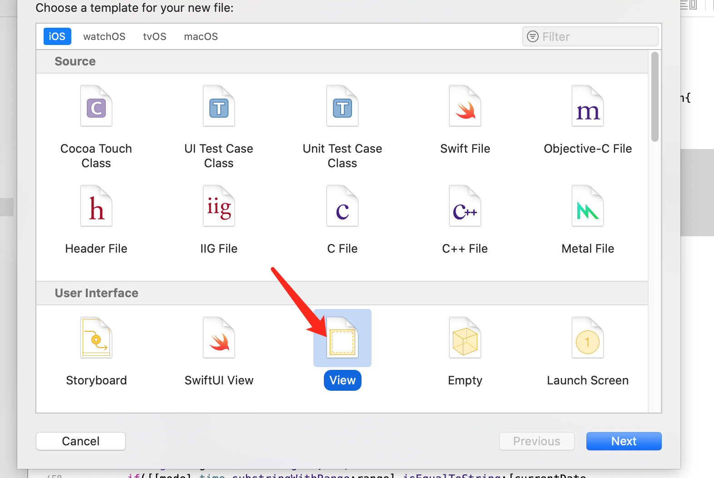
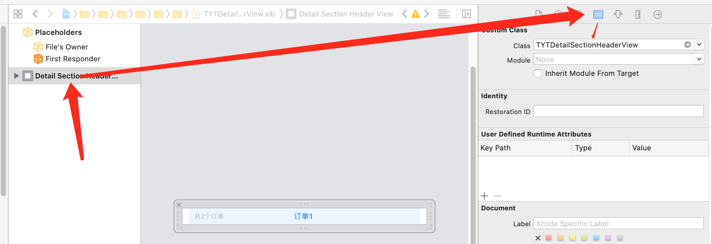
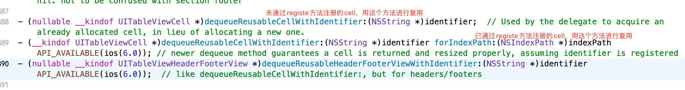
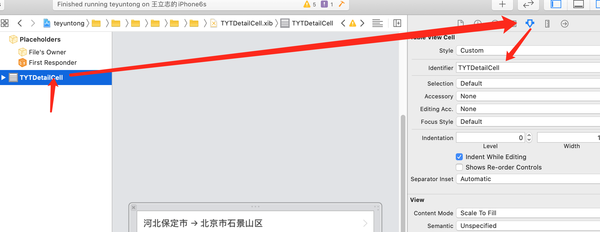
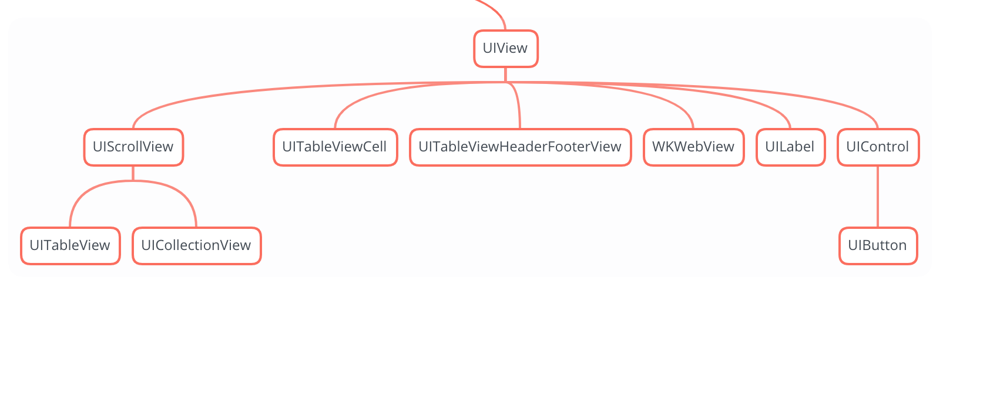

最近开发遇到了一个比较复杂的页面，涉及到了```tableHeaderView```、```tableFooterView```、```SectionHeaderView```、```SectionFooterView```、```UITableViewCell```等五个```view```，其中```tableHeaderView```、```tableFooterView```只是两个简单的```view```，只需要你写一个方法或者自定义一个子类创建即可，而另外三个都涉及到了代码自定义```view```或者```xib```创建以及复用三个方面，接下来我们用```SectonHeader```为例子从两种创建方式入手讲解一下正确的创建及复用方式


# 一、代码创建
代码创建起来比较简单也没有太多需要讲的地方，跟```UITableViewCell```一模一样
## 1.1、创建
创建类，继承```UITableViewHeaderFooterView```，重写父类方法如下：

```
- (instancetype)initWithReuseIdentifier:(NSString *)reuseIdentifier{
    if(self == [super initWithReuseIdentifier:reuseIdentifier]){
        //布局操作
        [self createSubviews];
    }
    return self;
}
```
## 1.2、复用
```
- (UIView *)tableView:(UITableView *)tableView viewForHeaderInSection:(NSInteger)section{
    TYTMineWalletSectionHeaderView *headerView = [tableView dequeueReusableHeaderFooterViewWithIdentifier:@"TYTMineWalletSectionHeaderView"];
    if(headerView == nil){
        headerView = [[TYTMineWalletSectionHeaderView alloc] initWithReuseIdentifier:@"TYTMineWalletSectionHeaderView"];
    }
}
```

# 二、```xib```创建

## 2.1、创建
由于创建继承自```UITableViewHeaderFooterView ```类的时候不能直接勾选```xib```选项，这就需要我们创建一个空白的```xib```与自定义的类进行关联，这时候要取一个跟刚才类一样的名字，接下来给```xib```里边的```view```与你创建的类关联即可


### tip:
①、```xib```的名字可以随便取，只不过涉及到相关的```loadNib```方法你就需要用正确的名字

②、创建```xib```的时候，```View```跟```Empty```区别就是前者创建完成后会有一个空白的```view```，仅此而已

## 2.2、复用

### 2.2.1、复用方式一
```UITableViewCell ```、```UITableViewHeaderFooterView```都可以用这种代码的方式进行复用，只要用```registerNib```方法注册了这个```xib```，那么你就可以直接通过```UITableView```的方法对它进行复用

```
- (void)viewDidLoad {
    [super viewDidLoad];
    [self.tableView registerNib:[UINib nibWithNibName:@"TYTDetailSectionHeaderView" bundle:nil] forHeaderFooterViewReuseIdentifier:@"TYTDetailSectionHeaderView"];
}
```

```
- (UIView *)tableView:(UITableView *)tableView viewForHeaderInSection:(NSInteger)section{
    TYTDetailSectionHeaderView *header = [tableView dequeueReusableHeaderFooterViewWithIdentifier:@"TYTDetailSectionHeaderView"];
    return header;
}

- (CGFloat)tableView:(UITableView *)tableView heightForHeaderInSection:(NSInteger)section{
    return 30;
}
```
#### tip
需要注意的是，如果提前注册了```xib```，那么```UITableViewCell```的复用方法是另一个，可以看第二个方法的注释，```assuming identifier is registered```(假设这个标识符已经注册了)


### 2.2.1、```xib```创建```UITableViewCell```特有的复用方式二
大家在```xib```中拖控件的时候可以发现并没有```UITableViewHeaderFooterView```这个控件，但是有```UITableViewCell```这个控件，所以```UITableViewCell```可以不用注册，而是可以在```xib```中手动添加标识符，之后就可以进入复用流程了


```
- (UITableViewCell *)tableView:(UITableView *)tableView cellForRowAtIndexPath:(NSIndexPath *)indexPath{
    NSString *identifier = @"TYTDetailCell";
    TYTDetailCell *cell = [tableView dequeueReusableCellWithIdentifier:@"TYTDetailCell"];
    if(cell == nil){
        cell = [[[NSBundle mainBundle] loadNibNamed:identifier owner:self options:nil] lastObject];
    }
    cell.selectionStyle = UITableViewCellSelectionStyleNone;
    return cell;
}
```

### 思维发散
如下这么多控件继承自```UIView```，按照上边的思路，```UILabel```、```UIButton```等这些控件，都可以使用```xib```进行自定义，定义完成之后通过```loadNibNamed```方法进行创建即可
