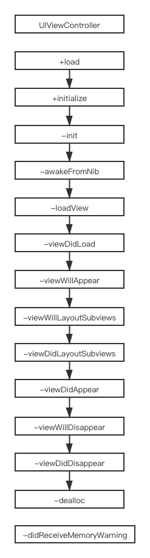

```UIViewController```的生命周期作为一个基本知识点，大家都了解的清楚嘛，咱们先说一下顺序，然后再具体解释


### 需要注意的点
1、按道理来讲通过```xib```创建的控制器加载的时候需要调用方法```awakeFromNib```，但是事实是没有调用，只有通过```xib```创建的```UIView```或者其子类才会调用此方法

2、```+load```是类加载的时候调用，```+initialize```类创建的时候调用，```+load```还是尽量少用，可以加快启动速度

3、```loadView```的作用是加载控制器管理的```view```，如果控制器有关联的```nib```文件，该方法会自动做关联并加载```view```,如果没有关联的```nib```文件，则创建空白的```view```对象

4、你可以在```loadView```方法中创建```self.view```，一般不用实现此方法，如果实现了此方法那么在这个方法里边必须调用```[super loadView]```或者手动把创建```self.view```，原因见第5条

5、```viewDidLoad```方法的前提是```self.view```已经创建完成，如果执行到此方法的时候，还没有创建```self.view```对象，那么系统就会去调用```loadView```方法去创建```view```，这时候如果```loadView```方法中不能创建```view```，这时候系统就会造成死循环，猜测系统内部代码如下：

```
- (void)loadView{
    [self viewDidLoad];
}

- (void)viewDidLoad {
    [super viewDidLoad];
    if(self.view == nil){
        [self loadView];
    }
}

```

6、```viewWillLayoutSubviews```方法在布局```view```的子控件的时候调用