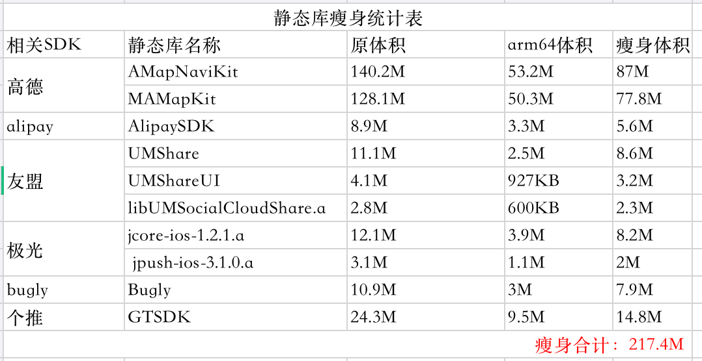

## 一、准备工作
### 1.1、目前`app`的情况
- 项目文件 475.6M
- ipa 57.2M
- 可执行文件 50.6M

### 1.2、`ipa`包内容解析
给app打包，得到ipa文件，然后把后缀名改为zip，解压后如图

- 有1430个项目，共87.3MB
- 图片数量占到了99%以上
- 占内存最大的是app的可执行文件，占了50.6MB


接下来我们就可以针对这些文件进行优化了

## 二、废弃资源、代码清理
### 2.1、`AppCode`排查废弃类、方法、属性
下载```AppCode```(```AppCode```是一个可以用来开发iOS程序的民间付费IDE)，```Code``` -> ```Inspect Code``` -> ```Unused Code```，这时候就会显示出哪些类、方法、属性、引用、参数没有被使用过，就可以进行优化，记得二次确认。

在这一步删除了没有使用到的类几十个，方法几十个，无效引用几百个

### 2.2、`LSUnusedResources`排查废弃的图片资源
[LSUnusedResources](https://github.com/tinymind/LSUnusedResources)，下载之后按照教程操作即可，点击`Full Path(Double Click to Open)`这一列，会按照文件排序，方便删除
如下图所示，没有用到的图片288张，总共4248.14kb，现在可以挨个进行删除了，需要再次确认下是不是真的没有用到，比如有些图片资源在代码中是这样写的，那么这些图片就不能删除了，一定要小心

```
NSString *imageName = [NSString stringWithFormat:@"newfeature_%d", i+ 1];
```


> 这一波操作结束之后，删除图片540多张，`ipa`包的大小由原来的57.2M减小为51.2M


### 2.3、排查项目中不用的```SDK```
这个东西就要看大家的发挥了，我这里只说说我的经历

- 项目中用到了友盟分享，但是只分享到微信，我就把多余的qq、支付宝、微博的代码删了，节省空间24.2M

## 四、静态库拆分```arm64```架构
> 看这部分之前先看一下我的另外两篇文章[iOS-iPhone的CPU架构](https://lizhidada.github.io/2019/11/26/iOS-iPhone%E7%9A%84CPU%E6%9E%B6%E6%9E%84/)、[iOS-动态库与静态库](https://lizhidada.github.io/2019/11/26/iOS-%E5%8A%A8%E6%80%81%E5%BA%93%E4%B8%8E%E9%9D%99%E6%80%81%E5%BA%93/)

有了上边两篇文章的基础，接下来我们就可以很方便的操作了
### 4.1、找到项目中所有的静态库```.a```、```.framework```
反正大家项目中用到的SDK也就那么几个，最多十几个，挨个找出来，copy一份出来，挨个查看一下静态库都支持哪些架构，然后拆分出```arm64	```架构的静态库替换掉项目中的静态库即可，拆封方法见[iOS-动态库与静态库](https://lizhidada.github.io/2019/11/26/iOS-%E5%8A%A8%E6%80%81%E5%BA%93%E4%B8%8E%E9%9D%99%E6%80%81%E5%BA%93/)

最后我拆分的效果如下：


## 五、最终结果
瘦身前：

- 项目文件 475.6M
- ipa 57.2M
- 可执行文件 54.4M

瘦身后：

- 项目文件 213.2M
- ipa 36M
- 可执行文件 24.6M

> 这只是最浅显的瘦身的方法，还有更底层的等待我们去发掘
