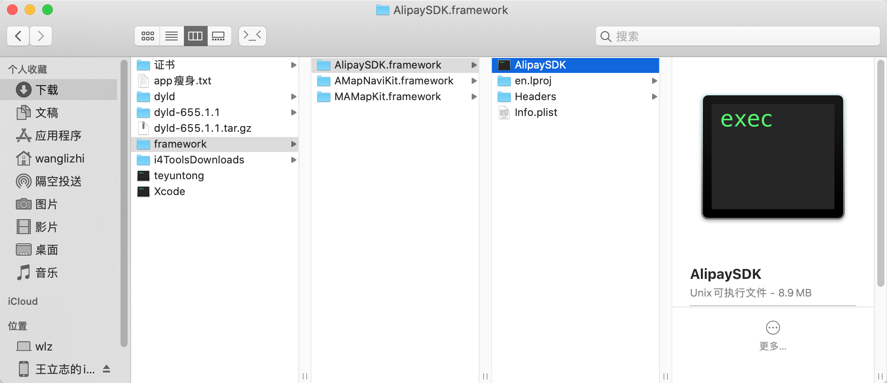
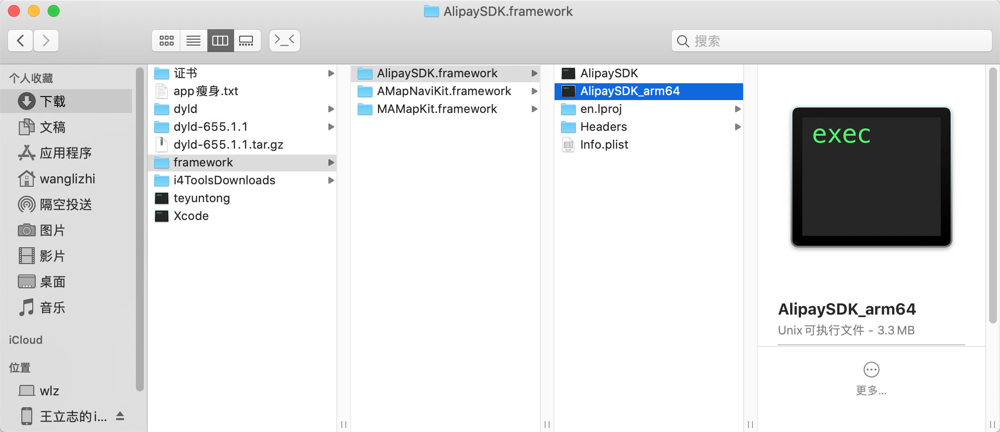

## 一、什么是库
库是程序代码的集合，是共享代码的一种方式，实现代码复用，一般来说分为静态库和动态库。
## 二、静态库和动态库的区别

- 静态库：```.a```、```.framework```
- 动态库：```.framework```、```.dylib```、```.tbd```

tips:

1、系统的```framework```是动态的，我们自己创建的```framework```是静态的

2、```Xcode7```之后```.dylib```改名为```.tbd```，应该是```.tbd```比```.dylib```占用内存小

3、创建```framework```的时候，我们要选择```static library```，因为系统不允许我们使用动态库，而且我们使用动态库提交```AppStore```是会被拒的

## 三、静态库拆分
> 假设我在当前文件夹下放了支付宝的动态库


### 3.1、查看静态库都支持哪些架构
```
wanglizhi@wlz:~/Downloads/framework$     lipo -info AlipaySDK.framework/AlipaySDK
Architectures in the fat file: AlipaySDK.framework/AlipaySDK are: i386 x86_64 armv7 arm64
```

### 3.2、拆分出```arm64```架构的静态库
```
wanglizhi@wlz:~/Downloads/framework$     lipo AlipaySDK.framework/AlipaySDK -thin arm64 -output AlipaySDK.framework/AlipaySDK_arm64
```



由上边两幅图可以看出，静态库可执行文件的体积减少了63%，这要是把项目里所有的静态库都拆分为只支持```arm64```，那简直就是究极舒服。


