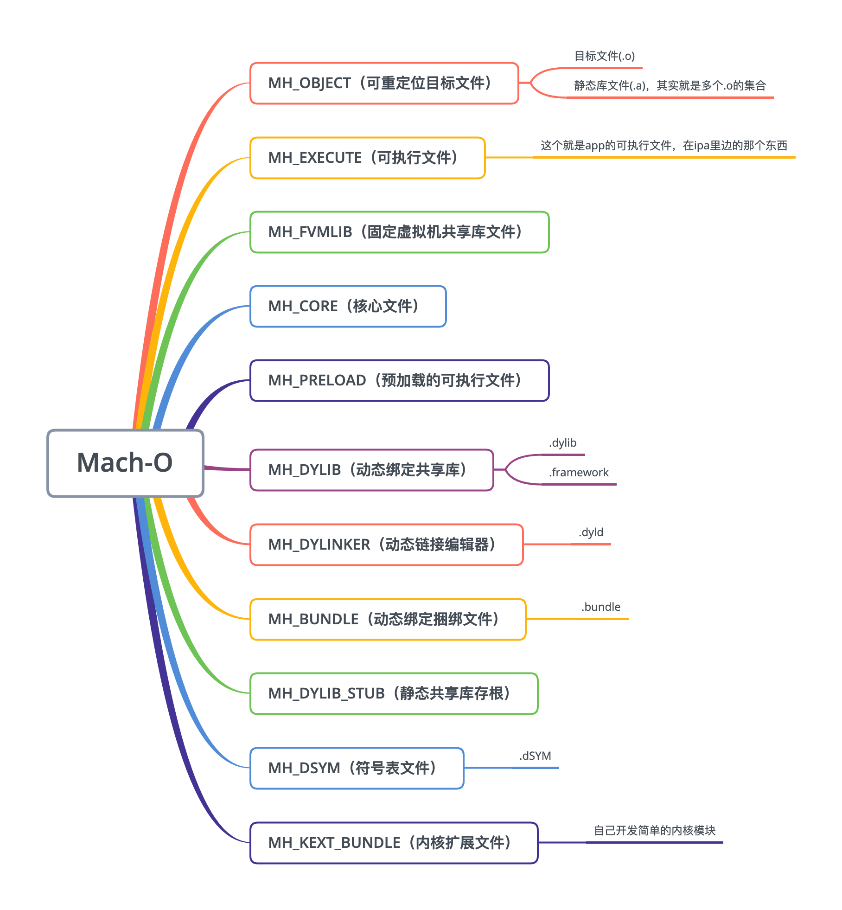
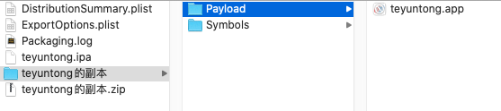
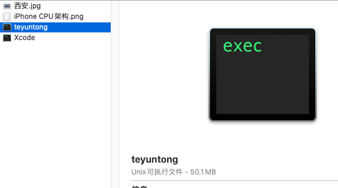
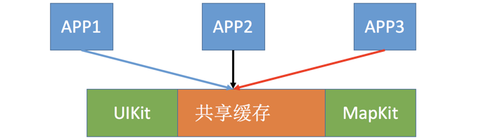
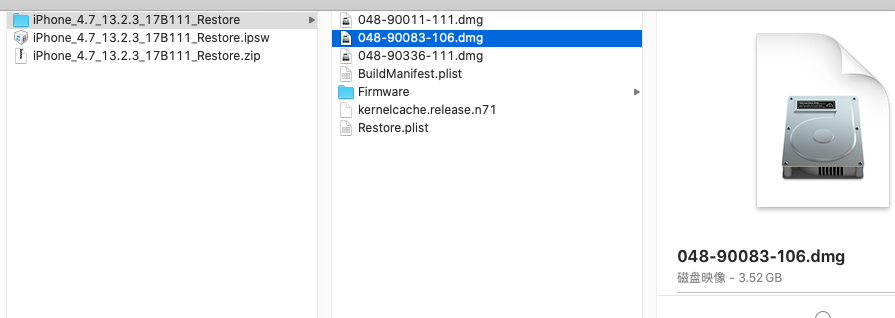
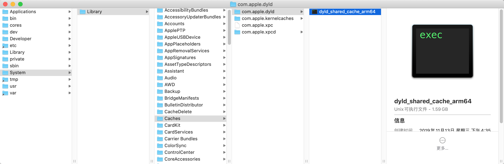
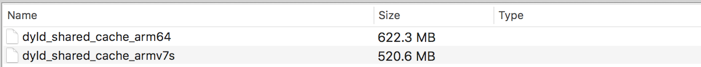
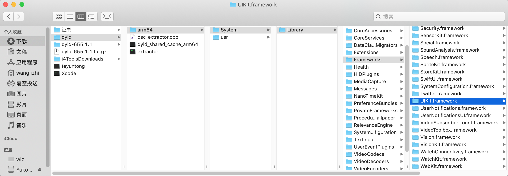

## 一、名词解释
- Mach-O：Mach Object文件格式的缩写，它是一种用于可执行文件，目标代码，动态库，内核转储的文件格式，曾经为大部分基于Mach核心的操作系统所使用
- Mach：一个由卡内基梅隆大学开发的用于支持操作系统研究的操作系统内核

## 二、```Mach-O```文件格式
```Mach-O```文件是一类文件的简称，从源文件中可以得到结果
```#import <mach-o/loader.h>```

```
#define	MH_OBJECT	0x1		/* relocatable object file */
#define	MH_EXECUTE	0x2		/* demand paged executable file */
#define	MH_FVMLIB	0x3		/* fixed VM shared library file */
#define	MH_CORE		0x4		/* core file */
#define	MH_PRELOAD	0x5		/* preloaded executable file */
#define	MH_DYLIB	0x6		/* dynamically bound shared library */
#define	MH_DYLINKER	0x7		/* dynamic link editor */
#define	MH_BUNDLE	0x8		/* dynamically bound bundle file */
#define	MH_DYLIB_STUB	0x9		/* shared library stub for static */
					/*  linking only, no section contents */
#define	MH_DSYM		0xa		/* companion file with only debug */
					/*  sections */
#define	MH_KEXT_BUNDLE	0xb		/* x86_64 kexts */
```


下边就用我们项目的可执行文件介绍一下```Mach-O```文件的结构，如下图所示，把```ipa```文件的后缀名改为```zip```，解压后得到```teyuntong.app```，然后显示包内容得到可执行文件，复制到下载文件夹中



## 三、动态库共享缓存
### 3.1、共享缓存机制
> 在iOS系统中，每个程序依赖的动态库都需要加载到内存中，如果每个程序都加载一遍，那么肯定会造成内存浪费，为了提高手机性能，共享缓存机制应运而生，从iOS3.1开始，为了提高性能，绝大部分的系统动态库文件都打包存放到了一个缓存文件中，这样内存中只需要加载一份动态库文件



### 3.2、```dyld```介绍
```dyld```也是一个可执行文件，在手机中的位置是```/usr/lib/dyld```，```dyld```（```the dynamic link editor```）是苹果的动态链接器，是苹果操作系统一个重要组成部分，用于加载以下类型的```Mach-O```文件

- ```MH_EXECUTE``` 我们```APP```的可执行文件
- ```MH_DYLIB```  先判断动态库共享缓存中是否有这个动态库，如果没有的话，就加载；如果有的话就直接链接
- ```MH_BUNDLE```

### 3.3、动态库共享缓存文件位置
> ```dyld```(dynamic link editor 动态库共享缓存)文件在手机中的位置是```/System/Library/Caches/com.apple.dyld/dyld_shared_cache_armX```，这个文件位置需要越狱手机才能查看，而我的手机因为越狱半年之后变卡，所以又更新为了非越狱版本，越狱的相关信息可以查看我的另一篇文章[iOS逆向入门解析](https://juejin.im/post/5af2f94351882567096135d8)，既然不能从真机上获取动态库共享缓存，那我们就用iOS固件包来获取，我这里是用爱思助手下载的iOS13.2.3的固件包，下载完之后将固件包的后缀名改外```.zip```，然后解压，找到一个占内存最大的```dmg```文件，双击之后即可根据上边的路径来找到动态库共享缓存



> 下边是共享缓存的位置



> 在一开始的系统中，由于要适配```armv7s```、```arm64```两个```CPU```架构，所以该目录下是有两个版本的缓存文件的，现在我们下载的```iOS13.2.3```固件只支持```arm64```架构，所以此目录下只有一个缓存文件



### 3.4、解压```dyld_shared_cache_arm64```
接下来我们要看看这么大个可执行文件里边到底是什么东西

去[dyld源码](https://opensource.apple.com/tarballs/dyld/)下载一份最新的压缩包，我下载的是```dyld-655.1.1```，解压之后去```launch-cache```目录下找到```dsc_extractor.cpp```文件，删除```#if 0```以上所有代码和最底部的```#endif```，只留下一个```main```方法，然后把这个```C++```(```C++```在国外通常读做```C plus plus```所以```.cpp```就是```C++```文件)文件跟```dyld_shared_cache_arm64```单独放到一个文件夹中，并执行以下命令

```
wanglizhi@wlz:~/Downloads/dyld$    clang++ -o extractor dsc_extractor.cpp
wanglizhi@wlz:~/Downloads/dyld$    ./extractor dyld_shared_cache_arm64 arm64
```
这样就看到了动态库共享缓存里边都有哪些文件了

## 四、```CPU```架构
由于苹果手机更新换代比较快，所以你的代码必须要支持市面上大部分苹果手机的架构，而苹果手机使用的处理器是arm架构，下图明确表达了苹果的机型都用的什么处理器，所以可以这么说，你的代码以及导入的所有三方库只要支持```arm64```一种架构即可
> iPhone6s中的s是speed，速度的意思


